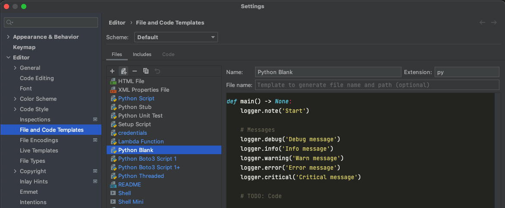
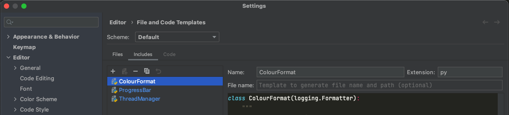

## Pycharm Templates

### My pycharm templates using Apache Velcoity

### blank:

Setup a basic python script with:
- Logging, with colour output and log rotation

### blank_aws_1:

Setup a python script to access a aws account with:
- Boto3, command line parameters to choose account and regions
- Logging, with colour output and log rotation

### blank_aws_2:

Setup a python script to access multiple aws accounts with:
- Boto3, command line parameters to choose accounts and regions
- Logging, with colour output and log rotation

### blank_threaded:

Setup a multithreading python script with:
Logging, with colour output and log rotation
Threaded function

## How to use:

Add the files and the includes into your pycharm templates directory

## Versions:

1.0
