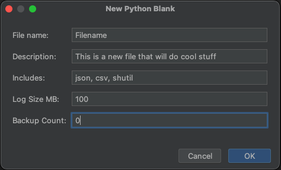
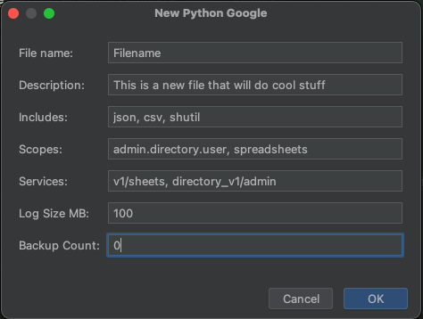
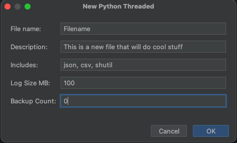

# Pycharm Templates

### My pycharm templates using Apache Velcoity

## WARNING: Bugs in pycharm

### Bugs in pycharm:

#### This took some figuring out why things break in weird ways when making updates

1. Pycharm is caching in memory the macros, so if you change the macros you need to restart pycharm or rename the macros
2. Leading indents in the macros cause indentation errors in the generated code, but NOT necessarily where the macro
   runs

## blank.py:

Set up a basic python script with:

- Logging, with colour output and log rotation

[More detail](README_BLANK_PY.md)

## blank_aws_1.py:

Set up a python script to access a AWS account with:

- Boto3, command line parameters to choose account and regions
- Logging, with colour output and log rotation

[More detail](README_BLANK_AWS_PY.md)

## blank_aws_2.py:

Set up a python script to access multiple AWS accounts with:

- Boto3, command line parameters to choose accounts and regions
- Logging, with colour output and log rotation

[More Detail](README_BLANK_AWS_PY.md)

## blank_google_workspaces.py:

Set up a python script to access Googles API:

- Google json credentials for authentication
- Logging, with colour output and log rotation

[More detail](README_BLANK_GOOGLE_WORKSPACES_PY.md)

## blank_threaded.py:

Set up a multithreading python script with:

- Logging, with colour output and log rotation
- Threaded function
- Progress bar

[More detail](README_BLANK_THREADED_PY.md)

## blank_shell.py:

Set up a shell script with coloured logging and an exit trap:

- Logging, with colour output
