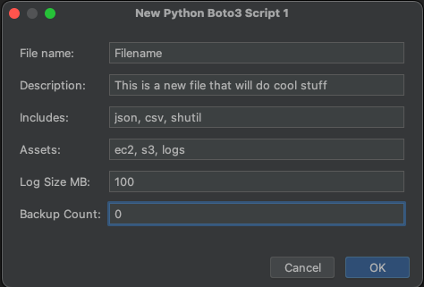

# Pycharm Templates

### My pycharm templates using Apache Velcoity

## blank_aws_1.py:

Setup a python script to access a AWS account with:

- Boto3, command line parameters to choose account and regions
- Logging, with colour output and log rotation



```python
#!/usr/bin/env python3

__author__ = 'Shane Young'
__version__ = '1.0'
__email__ = 'thedzy@thedzy.com'
__date__ = '2023-01-01'
__credits__ = ''

__description__ =
    """
    Filename.py: 
    This is a new file that will do cool stuff
    """

import argparse
import logging
from logging.handlers import RotatingFileHandler
from pathlib import Path
import pprint
import json
import csv
import shutil

import boto3 as aws
import botocore


class ColourFormat(logging.Formatter):
    ...


def main() -> None:
    logger.info('Start')

    # Create session
    session = aws.Session(
        profile_name=options.profile
    )

    for region in options.regions:
        # Verify that we have credentials
        if not session.get_credentials():
            logger.error(f'No credentials for {options.profile}')
            exit()

        try:
            logger.info(f'Processing {region} for profile {options.profile}:')

            # Create clients
            ec2 = session.client('ec2', region_name=region)
            s3 = session.client('s3', region_name=region)
            logs = session.client('logs', region_name=region)

            # TODO: code

        except botocore.exceptions.NoCredentialsError:
            logger.error(f'No credentials for {options.profile}')
            return
        except ec2.exceptions.ClientError as err:
            logger.error(f'Error : ec2 {err}')
            return
        except s3.exceptions.ClientError as err:
            logger.error(f'Error : s3 {err}')
            return
        except logs.exceptions.ClientError as err:
            logger.error(f'Error : logs {err}')
            return
        except KeyboardInterrupt:
            logger.critical('Operation cancelled by user')
            logger.debug('Exception information:', exc_info=True)

    logger.info('Done')


def create_logger(name: str = __file__, levels: dict = {}) -> logging.Logger:
    ...


if __name__ == '__main__':
    def valid_path(path):
        parent = Path(path).parent
        if not parent.is_dir():
            print(f'{parent} is not a directory, make it?')
            if input('y/n: ').lower() == 'y':
                parent.mkdir(parents=True, exist_ok=True)
                Path(path)
            raise argparse.ArgumentTypeError(f'{path} is not a directory')
        return Path(path)


    # Create argument parser
    parser = argparse.ArgumentParser(description=__description__)

    # Instances
    parser.add_argument('-p', '--profile', default='default',
                        action='store', dest='profile', choices=aws.session.Session().available_profiles,
                        metavar='NAME',
                        help='profile name, '
                             'Choices: %(choices)s')

    # Region
    parser.add_argument('-r', '--regions', default=['us-west-2'], nargs=argparse.ONE_OR_MORE,
                        action='store', dest='regions', choices=aws.session.Session().get_available_regions('ec2'),
                        metavar='NAME',
                        help='region name(s) default: %(default)s')

    # Debug option
    parser.add_argument('--debug', default=20,
                        action='store_const', dest='debug', const=10,
                        help=argparse.SUPPRESS)

    # Output
    parser.add_argument('-o', '--output', type=valid_path, default=None,
                        action='store', dest='output',
                        help='output log')

    options = parser.parse_args()

    logger = create_logger(levels={'note': 21})
    logger.debug('Debug ON')
    logger.debug(pprint.pformat(options))

    main()
```

## blank_aws_2.py:

Setup a python script to access multiple AWS accounts with:

- Boto3, command line parameters to choose accounts and regions
- Logging, with colour output and log rotation


```python
#!/usr/bin/env python3

__author__ = 'Shane Young'
__version__ = '1.0'
__email__ = 'thedzy@thedzy.com'
__date__ = '2023-01-01'
__credits__ = ''

__description__ =
    """
    Filename.py: 
    This is a new file that will do cool stuff
    """

import argparse
import logging
from logging.handlers import RotatingFileHandler
from pathlib import Path
import pprint
import json
import csv
import shutil

import boto3 as aws
import botocore


class ColourFormat(logging.Formatter):
    ...


def main() -> None:
    logger.info('Start')

    for profile in options.profiles:
        # Create session
        session = aws.Session(
            profile_name=profile
        )

        # Verify that we have credentials
        if not session.get_credentials():
            logger.error(f'No credentials for {options.profile}')
            exit()

        for region in options.regions:
            # Verify that we have credentials
            if not session.get_credentials():
                logger.error(f'No credentials for {options.profile}')
                exit()
    
            try:
                logger.info(f'Processing {region} for profile {options.profile}:')
    
                # Create clients
                ec2 = session.client('ec2', region_name=region)
                s3 = session.client('s3', region_name=region)
                logs = session.client('logs', region_name=region)
    
                # TODO: code
    
            except botocore.exceptions.NoCredentialsError:
                logger.error(f'No credentials for {options.profile}')
                return
            except ec2.exceptions.ClientError as err:
                logger.error(f'Error : ec2 {err}')
                return
            except s3.exceptions.ClientError as err:
                logger.error(f'Error : s3 {err}')
                return
            except logs.exceptions.ClientError as err:
                logger.error(f'Error : logs {err}')
                return
            except KeyboardInterrupt:
                logger.critical('Operation cancelled by user')
                logger.debug('Exception information:', exc_info=True)

    logger.info('Done')


def create_logger(name: str = __file__, levels: dict = {}) -> logging.Logger:
    ...

if __name__ == '__main__':
    def valid_path(path):
        parent = Path(path).parent
        if not parent.is_dir():
            print(f'{parent} is not a directory, make it?')
            if input('y/n: ').lower() == 'y':
                parent.mkdir(parents=True, exist_ok=True)
                Path(path)
            raise argparse.ArgumentTypeError(f'{path} is not a directory')
        return Path(path)


    # Create argument parser
    parser = argparse.ArgumentParser(description=__description__)

    # Instances
    parser.add_argument('-p', '--profile', default=['default'], nargs=argparse.ONE_OR_MORE,
                        action='store', dest='profiles', choices=aws.session.Session().available_profiles,
                        metavar='NAME',
                        help='profile name, '
                             'Choices: %(choices)s')

    # Region
    parser.add_argument('-r', '--regions', default=['us-west-2'], nargs=argparse.ONE_OR_MORE,
                        action='store', dest='regions', choices=aws.session.Session().get_available_regions('ec2'),
                        metavar='NAME',
                        help='region name(s) default: %(default)s')

    # Debug option
    parser.add_argument('--debug', default=20,
                        action='store_const', dest='debug', const=10,
                        help=argparse.SUPPRESS)

    # Output
    parser.add_argument('-o', '--output', type=valid_path, default=None,
                        action='store', dest='output',
                        help='output log')

    options = parser.parse_args()

    logger = create_logger(levels={'note': 21})
    logger.debug('Debug ON')
    logger.debug(pprint.pformat(options))
```