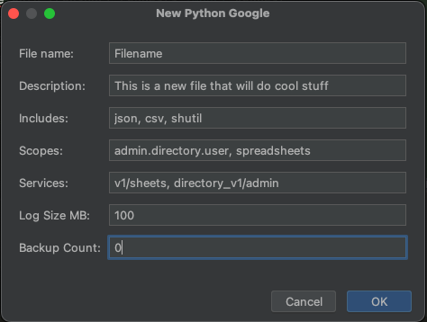

# Pycharm Templates

### My pycharm templates using Apache Velcoity

## blank_google_workspaces.py:

Setup a python script to access Googles API:

- Google json credentials for authentication
- Logging, with colour output and log rotation

## Setting up Google Workspace API
- Create an Oauth app in GCP and give it the scopes you need
- Download json credentials



```python
#!/usr/bin/env python3

__author__ = 'Shane Young'
__version__ = '1.0'
__email__ = 'thedzy@thedzy.com'
__date__ = '2023-01-01'
__credits__ = ''

__description__ =
    """
    Filename.py: 
    This is a new file that will do cool stuff
    """

import argparse
import logging
from logging.handlers import RotatingFileHandler
import pprint
from pathlib import Path
import json
import csv
import shutil

import google.auth.exceptions
from google.auth.transport.requests import Request
from google.oauth2.credentials import Credentials
from google_auth_oauthlib.flow import InstalledAppFlow
from googleapiclient.discovery import build


class ColourFormat(logging.Formatter):
    ...


def main() -> None:
    logger.note('Start')

    scopes = [
        'https://www.googleapis.com/auth/admin.directory.user',
        'https://www.googleapis.com/auth/spreadsheets',
    ]
    credentials = auth_google(scopes, options.google_credentials, options.save_credentials)
    if not credentials:
        logger.critical('Unable to authenticate')
        exit(1)

    # Create the Google Sheets APIs
    sheets = build('sheets', 'v1', credentials=credentials)
    admin = build('admin', 'directory_v1', credentials=credentials)
    
    # TODO: code

    logger.note('Done')


def auth_google(scopes: list, credentials_json: str, save_json: bool = False) -> Credentials:
    """
    Authenticate with Google Workspaces API
    :param scopes: List of scopes to authenticate with
    :param credentials_json: Json file with credentials
    :param save_json: Save scope and token to json file
    :return: Credentials object
    """
    credentials_file = Path(__file__).parent.joinpath(credentials_json.name)
    # Check if credentials file already contains credentials and token
    try:
        credentials = Credentials.from_authorized_user_file(credentials_file, scopes)

        if credentials.expired and credentials.refresh_token:
            credentials.refresh(Request())

        return credentials
    except ValueError:
        try:
            logger.info('Web credentials not found, attempting to generate new ones')
            flow = InstalledAppFlow.from_client_secrets_file(credentials_file, scopes)
            credentials = flow.run_local_server(port=0)

            # Save the credentials for the next run and skip web auth
            if save_json:
                credentials_json.write(credentials.to_json())
            return credentials
        except ValueError as err:
            logger.error(f'Error processing credentials: {err}', exc_info=True)
            return None
        except Exception as err:
            logger.critical(f'Unknown error: {err.args}', exc_info=True)
    except google.auth.exceptions.RefreshError as err:
        logger.error(f'Error refreshing credentials: {err.args[1].get("error_description")}')
        return None
    except Exception as err:
        logger.critical(f'Unknown error: {err.args}', exc_info=True)

    return None


def create_logger(name: str = __file__, levels: dict = {}) -> logging.Logger:
    ...


if __name__ == '__main__':
    ...

```